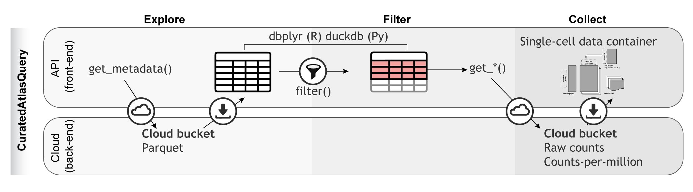

# HCA Project

The Human Cell Atlas (HCA) is a large project that aims to learn from and map
every cell type in the human body. The project extracts spatial and molecular
characteristics in order to understand cellular function and networks. It is an
international collaborative that charts healthy cells in the human body at all
ages. There are about 37.2 trillion cells in the human body. To read more about
the project, head over to their website at https://www.humancellatlas.org.

# CELLxGENE

CELLxGENE is a database and a suite of tools that help scientists to find,
download, explore, analyze, annotate, and publish single cell data. It includes
several analytic and visualization tools to help you to discover single cell
data patterns. To see the list of tools, browse to
https://cellxgene.cziscience.com/.

# The CuratedAtlasQueryR Project

To systematically characterize the immune system across tissues, demographics
and multiple studies, single cell transcriptomics data was harmonized from the
CELLxGENE database. Data from 28,975,366 cells that cover 156 tissues (excluding
cell cultures), 12,981 samples, and 324 studies were collected. The metadata was
standardized, including sample identifiers, tissue labels (based on anatomy) and
age. Also, the gene-transcript abundance of all samples was harmonized by
putting values on the positive natural scale (i.e. non-logarithmic).

To model the immune system across studies, we adopted a consistent immune
cell-type ontology appropriate for lymphoid and non-lymphoid tissues. We applied
a consensus cell labeling strategy between the Seurat blueprint and Monaco
[-@Monaco2019] to minimize biases in immune cell classification from
study-specific standards.

`CuratedAtlasQueryR` supports data access and programmatic exploration of the
harmonized atlas. Cells of interest can be selected based on ontology, tissue of
origin, demographics, and disease. For example, the user can select CD4 T helper
cells across healthy and diseased lymphoid tissue. The data for the selected
cells can be downloaded locally into popular single-cell data containers. Pseudo
bulk counts are also available to facilitate large-scale, summary analyses of
transcriptional profiles. This platform offers a standardized workflow for
accessing atlas-level datasets programmatically and reproducibly.

```{r,echo=FALSE}

```

# Data Sources in R / Bioconductor

There are a few options to access single cell data with R / Bioconductor.

| Package | Target | Description |
|---------|-------------|---------|
| [hca](https://bioconductor.org/packages/hca) | [HCA Data Portal API](https://www.humancellatlas.org/data-portal/) | Project, Sample, and File level HCA data |
| [cellxgenedp](https://bioconductor.org/packages/cellxgenedp) | [CellxGene](https://cellxgene.cziscience.com/) | Human and mouse SC data including HCA |
| [CuratedAtlasQueryR](https://stemangiola.github.io/CuratedAtlasQueryR/) | [CellxGene](https://cellxgene.cziscience.com/) | fine-grained query capable CELLxGENE data including HCA |

# Installation

```{r}
if (!requireNamespace("BiocManager", quietly = TRUE))
    install.packages("BiocManager")

BiocManager::install("CuratedAtlasQueryR")
```

# Package load 

```{r,include=TRUE,results="hide",message=FALSE,warning=FALSE}
library(CuratedAtlasQueryR)
library(dplyr)
```

# HCA Metadata

The metadata allows the user to get a lay of the land of what is available
via the package.

```{r}
metadata <- get_metadata()
```

# Summarizing the metadata

For each distinct tissue and dataset combination, count the number of datasets
by tissue type. 

```{r}
metadata |>
  dplyr::distinct(tissue, dataset_id) |> 
  dplyr::count(tissue)
```

# Columns available in the metadata

```{r}
head(names(metadata), 10)
```

## Download single-cell RNA sequencing counts 

### Query raw counts

```{r}
single_cell_counts <- 
    metadata |>
    dplyr::filter(
        ethnicity == "African" &
        stringr::str_like(assay, "%10x%") &
        tissue == "lung parenchyma" &
        stringr::str_like(cell_type, "%CD4%")
    ) |>
    get_SingleCellExperiment()

single_cell_counts
```

### Query counts scaled per million

This is helpful if just few genes are of interest, as they can be compared
across samples.

```{r}
metadata |>
  dplyr::filter(
      ethnicity == "African" &
      stringr::str_like(assay, "%10x%") &
      tissue == "lung parenchyma" &
      stringr::str_like(cell_type, "%CD4%")
  ) |>
  get_SingleCellExperiment(assays = "cpm")
```

### Extract only a subset of genes

```{r}
single_cell_counts <-
    metadata |>
    dplyr::filter(
        ethnicity == "African" &
        stringr::str_like(assay, "%10x%") &
        tissue == "lung parenchyma" &
        stringr::str_like(cell_type, "%CD4%")
    ) |>
    get_SingleCellExperiment(assays = "cpm", features = "PUM1")

single_cell_counts
```

### Extracting counts as a Seurat object

If needed, the H5 `SingleCellExperiment` can be converted into a Seurat object.
Note that it may take a long time and use a lot of memory depending on how many
cells you are requesting.

```{r,eval=FALSE}
single_cell_counts <-
    metadata |>
    dplyr::filter(
        ethnicity == "African" &
        stringr::str_like(assay, "%10x%") &
        tissue == "lung parenchyma" &
        stringr::str_like(cell_type, "%CD4%")
    ) |>
    get_seurat()

single_cell_counts
```

## Save your `SingleCellExperiment`

### Saving as HDF5 

The recommended way of saving these `SingleCellExperiment` objects, if
necessary, is to use `saveHDF5SummarizedExperiment` from the `HDF5Array`
package.

```{r, eval=FALSE}
single_cell_counts |> saveHDF5SummarizedExperiment("single_cell_counts")
```

# Session Info

```{r}
sessionInfo()
```

# References
